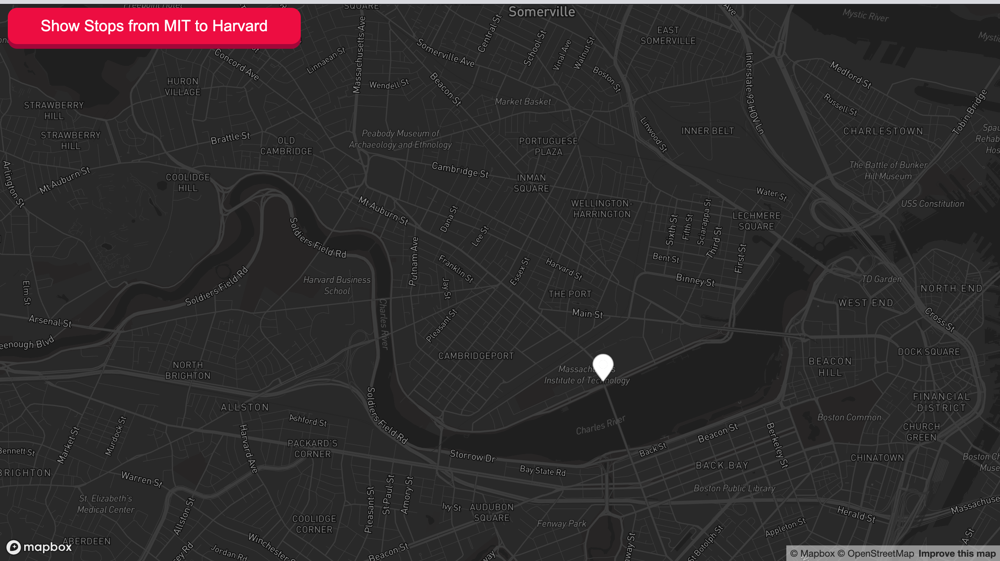

<h1>RealTimeBusTracker</h1>

This current project's purpose was to use (MBTA) JSON data to populate a Mapbox API every 15 seconds, to illustrate each bus stop from MIT to Harvard. Some of the changes that were made are; The button is now 3-D and a different color, I changed the color of the marker to white and finally I chose a different map version offered by Mapbox.

<h2>How to Run Code on Your Machine</h2>

1. Download the following files:
  -Index.html
  -Styles.css
  -mapAnimation.js

2. Open the "Index.html" file, insert your own API token in the (mapboxgl.accessToken = ' ')

3. Save changes on your Editor, Drag and Drop the HTML file onto your browser and the map should load, along with the button to show the bus stops!

<h3>Road to Future Improvements</h3>

  In the future I would like to incorporate more styling into my projects; possibly a different marker, some 3-D animation or visuals, and other minor details that help a project stand out! 

